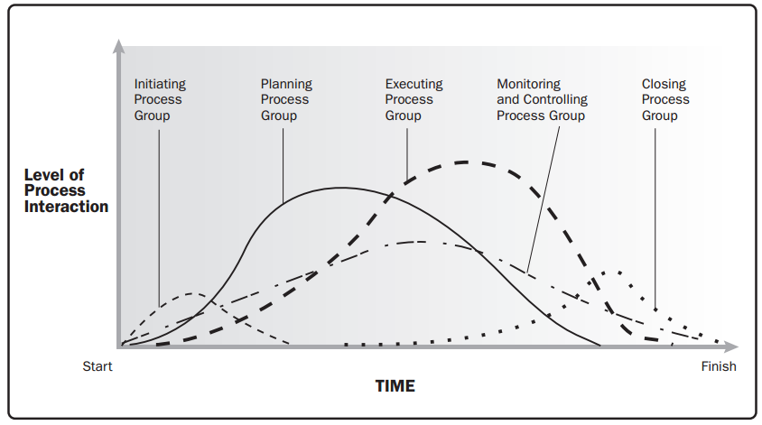

# Gestion

Martes: Gestión de proyectos
Jueves: Otros temas

Material de consulta: PMBok 6
* *PMI:* Org autonoma dedicada a desarrollar la  práctica profesional de gestion de proyectos
  * Confeccion de estandares internacionales (PMBOK)
  * Congresos convenciones y seminarios (CHAPTER)
  * Publicaciones
  * Certificaciones (PMP, CAPM, ACP, PDU)

*Proyecto:* Emprendimiento temporal realizado para crear un producto, servicio, o resultado único. Se lo puede ver como un conjunto _bien definido_ de tareas o actividades que deben realizarse para cumplir las metas del proyecto.
Características del proyecto:
* Temporal: Inicio y fin. Finales posibles: Objectivos alcanzados; Objetivos no pueden ser alcanzados; Necesidad del proyecto ya no existe.
* Único: No se hizo antes
* Elaboración gradual: Pasos sucesivos, coordinados.

## Administración Profesional de proyectos

Aplicación de conocimientos, habilidades, herramientas y técnicas en la actividad para cumplir los requerimientos del proyecto y administrarlos eficaz y eficientemente.

### Objetivo 
Proveer un ordenado y objetivo conjunto de procesos para obtener y manejar proyectos rentables.

```
   $
  / \
 /   \
T_____Q

$ = Dinero
T = Tiempo
Q = Calidad
```

Utilizar experiencias exitosos para mejorar estos procesos: Estándares, técnicas, checklists o procesos puntuales.

## Jerarquía de proyectos
* Proyecto
  * Programas: Ejemplo: Programa de nuevos negocios.
    * Portfolios: Atados a la estrategia de la companía. Programa - Fidelización - Portafolio customer centric.

PMO: Project management office
PPM: Project Program manager
PPM: Project porfolio manager

## Plan de proyecto
Conjunto de documentos aprobados usados para administrar y controlar la ejecución del proyecto

Documento vincular
Herramientas de gestión de proyecto

### Documentos
#### Acta de constitución de proyecto / Project charter
Primer documento formal con el que le damos inicio a nuestro proyecto.
Contiene directa o indirectamente:
* Propósito del proyecto
* Objetivos medibles
* Requerimientos de alto nivel
* Descripción de alto nivel
* Riesgos de alto nivel
* Resumen de fechas relevantes
* Resumen de presupuesto económico financiero
* Criterios de medición de éxito
* PM asignado
  * Nivel de autoridad y responsabilidad (Depende del tipo de organización *ver abajo*
* Nombre y autoridad del sponsor (o de quien autorice el acta)

#### Enunciado del alcance
*Propósito, entregables, objetivos, supuestos y limitaciones*

#### Convenios base
*Requerimientos técnicos y contractuales* 
#### Enfoque técnico
#### WBS
Work breakdown structure
#### OBS
Organization breakdown structure
#### Redes, estimaciones de costo y cronogramas
#### Recursos clave
#### Riesgos
#### Planes de contingencia
#### Método de administación de proyecto

## Gran machete
Ver cuadro subido por los profes a miel.
TODO: Linkear aca
### Areas de conocimiento
* Integración
* Alcance
* Tiempo (Cronograma)
* Costos (Finanzas)
* Calidad
* RRHH
* Comunicaciones
* Riesgos
* Adquisiciones
* Interesados

### Etapas
#### Ante proyecto
Ciclo de ventas, presupuesto, licitación, etc
#### Desarrollo
Desarrollo del proyecto propiamente dicho
Compuesto por los siguientes *Grupos de procesos:*
* Iniciación
* Planificación
* Ejecución
* Monitoreo y control
* Cierre

Nota: Anteriormente los grupos de procesos se llamaban etapas, pero se cambió para que encaje en agile (en metodologias ágiles, estos procesos se dan iterativamente, por eso ya no se consideran etapas)

### Gráfico de grupos de trabajo


Mayor participacion del PM en iniciacion, planificacion, monitoreo y control y cierre


# Tipos de organizaciones
## Orientadas a proyectos (o proyectizadas)
Ejemplos: Software factory, empresa constructora.
Tiene recursos (físicos o humanos), entra proyecto, asignan PM, firman acta, etc

Los recursos son asignados 100% a un proyecto

```
         PMO
          |
   ----------------
   |      |       |
   PM     PM     PM
   |
-------   ...     ...
|  |  |
Recursos
```
## Matriciales
Multiples departamentos, se asigna un PM, y se le asignan recursos compartidos con los distintos departamentos

Existen distintos niveles dentro de la org matricial

```
         ORG
          |
   ----------------------------------
   |      |          |              |
 Ventas  Marketing  Sistemas     Proyecto
   |                                |
-------   ...     ...              PM
|  |  |                             |
Recursos                       Recursos compartidos c/dptos
```

# Factores ambientales
Factores ambientales de la organización:
El administrador de proyecto (PM) debe adecuarse al ámbito de trabajo. Que sin dudas debe tenerse en cuenta para entender y diagramar correctamente el trabajo, sabiendo en que condiciones se desarrollará y qué flexibilidad existirá para actuar ante imprevistos.

Los factores pueden ser internos o externos.

*Factores:*
* Cultura estructura y procesos de la organización
* Normas y regulaciones gubernamentales o de la industria
* Infraestructura disponible
* Recursos humanos existentes (habilidades y experiencia / seniority)
* Políticas de personal
* Condiciones de mercado
* Tolerancia a los riesgos por parte de los interesados
* Canales de comunicación establecidos (Formales e informales)
* Bases de datos disponibles (Estimaciones, riesgos, base de conocimientos)
* Sistemas de información para la administración de proyectos.
