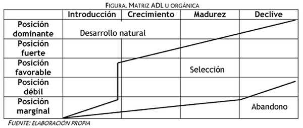
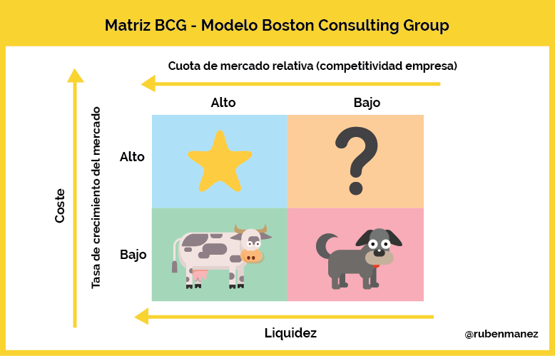
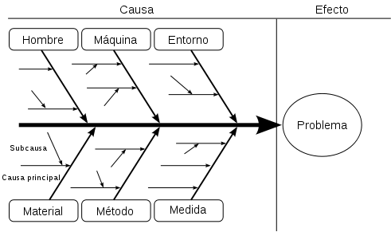
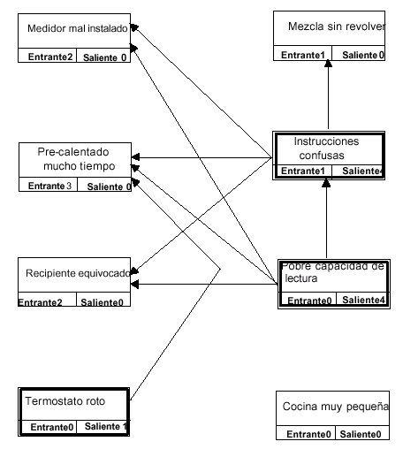
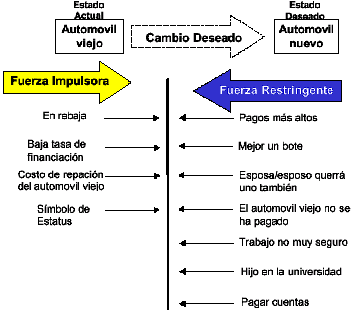

Clase pasada: Gestión, Sistemas de información (historia)

# Gestión del conocimiento

Pablo Peña Vendrell define gestion de conocimiento como:
* Conjunto de procedimientos, reglas y sistemas destinadas a captar, tratar, recuperar, presentar y transmitir los datos, informaciones y conocimentos de una organización.

* Dato - Información - Conocimiento

**Bill Gates:** Gestionar flujos de información y llevar info correcta a las personas que la necesitan.

* Creación
* Captura
* Organización
* Acceso
* Uso

## Objetivos
* Formular estrategia
* Implantar estrategias orientadas al conocimiento
* Promover mejora continua
* Monitorear y evaluar los logros
* Reducir tiempos y costos

## Matriz SECI
 
| **Interiorización** | **Socialización**   |
| `Conocimiento tacito` | `Conocimiento tacito` |
| **Combinación**     | **Exteriorización** |
| `Concepto explicito -> Conocimiento explicito` | `Conocimiento tácito -> Concepto explicito` |

## Capital intelectual

`Cap intelectual = Cap humano + Cap Estructural + Cap Relacional + Cap Social`

### Características
* Propio de una organización
* Intransferible

## Matrices de gestión
### Matriz ADL

### Matriz B.C.G (Boston Consulting Group)

Compara productos dentro de un mismo rubro. Los productos pueden estar en distintos puntos de la escala

Ejemplo Coca-Cola:
* Perro: Moster
* Vaca: Coca clasica
* Incognita: Life, Vitamin Water
* Estrella: Powerade

### Matriz F.O.D.A
Fortalezas, oportunidades, debilidades, amenazas.

Fortalezas y debilidades a nivel intero.
Oportunidades y amenazas a nivel externo

### Diagrama causa efecto (Ishikawa)

Herramienta cualitativa para detectar las multiples causas posibles que pueden llevan a un efecto observado

### Diagrama de pareto
Herramienta Cuantitativa para medición de causas y efectos
20% de las causas influyen en el 80% de los efectos

| Factor | % Ocurrencia | % Acumulado |
|--------|--------------|-------------|
| Relevamiento | 36 | 36 |
| Diagnostico | 34 | 70 |
| Estudio factibilidad | 20 | 90  |
| Análisis | 5 | 95 |
| Diseño | 4 | 99 |
| Implementación | 1 | 100 |

### Diagrama de interrelaciones
Herramienta cualitativa

### Campo de fuerza
Cualitativa

## Benchmarking
Proceso continuo de medir productos, servicios y prácticas contra los competidores más duros o aquellas compañías reconocidas como lideres en la industria.

* Estrategico competitivo
* Funcional

### Características

* Proactivo: Anticipar oportunidades y problemas. Debe conducir al cambio.
* Competitivo: desde adentro hacia afuera. Creando ventajas competitivas.
* Sistemas de medición adecuados

### Metodologías de medición
1. Identificar clientes
2. Traducir requerimientos
3. Determinar factores clave del servicio
4. 
5.
6. Determinar sistema de medición sencillo 
7. Enfatizar para que la forma de medir y analiza
8.
